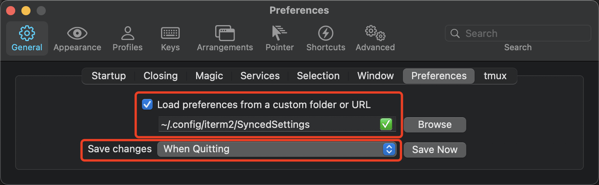

# SyncedSettings
This repo sync your Iterm2's settings from all devices

## Install
1. Clone this repo to your Iterm2's config directory.
	```
	git clone https://github.com/hellodudu/SyncedSettings ~/.config/iterm2/SyncedSettings
	```
2. Make Iterm2 load settings' file when opened, save settings' file when quit.

